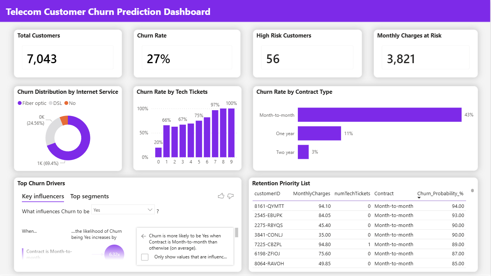

# 📞 Telco Customer Churn Analysis & Prediction

## 📌 Project Overview
Customer churn is a critical metric for telecommunications companies. This project aims to identify the key drivers of customer attrition and build a predictive model to identify high-risk customers. By combining **SQL exploration**, **Python Machine Learning**, and **Power BI visualization**, the project provides actionable insights to improve customer retention and revenue stability.

## 📁 Project Structure

CUSTOMER CHURN ANALYSIS/
│
├── 01_SQL Scripts/
│ └── Data_Exploration.sql
│
├── 02_Python Analysis/
│ └── Analysis.ipynb
│ └── Churn_Predictions_For_PowerBI.csv
│
├── 03_BI Dashboard/
│ └── Churn_Dashboard.pbix
│
├── 04_Insight Report/
│ └── Telecom_Customer_Churn_Prediction_Analysis.pdf
│
└── README.md        

## 🛠️ Tools & Technologies
- SQL: Data cleaning, window functions, and business metric aggregation.
- Python (Pandas, Scikit-Learn): Exploratory Data Analysis (EDA) and Predictive Modeling (Random Forest).
- Power BI: Interactive dashboarding and data storytelling.
- Machine Learning: Random Forest Classifier (Accuracy: 84.95%).

## 📊 Key Insights
After analyzing the data, three major churn drivers were identified:
1. **Contract Type**: Customers on Month-to-month contracts have a significantly higher churn rate compared to long-term contracts.
2. **Technical Friction**: Customers using Fiber Optic service who opened 3 or more Tech Support tickets have a >50% probability of leaving.
3. **The "Critical Period"**: The highest churn risk occurs within the first 10 months of the customer lifecycle.

## 💡 Business Recommendations
- **Targeted Retention**: Use the ML-generated list of 56 high-risk customers for immediate outreach by the Sales/Retention team.
- **Contract Conversion**: Incentivize Month-to-month customers to switch to 1-year plans by offering loyalty discounts or value-added services (e.g., free streaming).
- **Service Audit**: Conduct a technical review of the Fiber Optic infrastructure in areas with high ticket volume to reduce service-related dissatisfaction.

## 🖥️ Dashboard Preview

## 🚀 How to Use
**01_SQL Scripts**: 
- Import the dataset Customer_Churn_Dataset.csv into a table named customer_churn via MySQL environment set up (MySQL Workbench).
- Execute the scripts Data_Exploration.sql in the folder 01_SQL Scripts/ to perform data exploration and business logic aggregation.

**02_Python Analysis**:
- Open 02_Python Analysis/Analysis.ipynb in Jupyter Notebook or VS Code.
- Run all cells to view the end-to-end process of data cleaning, EDA, and model training (Random Forest).

**03_Power BI**: Open the Churn_Dashboard.pbix file in Power BI Desktop to interact with the visual reports and explore the predictive insights.

**04_Insight Report**:
- Open the 04_Insight Report/Telecom_Customer_Churn_Prediction_Analysis.pdf file to read the comprehensive business report.
- This document translates technical findings (SQL & Python results) into a strategic executive summary.